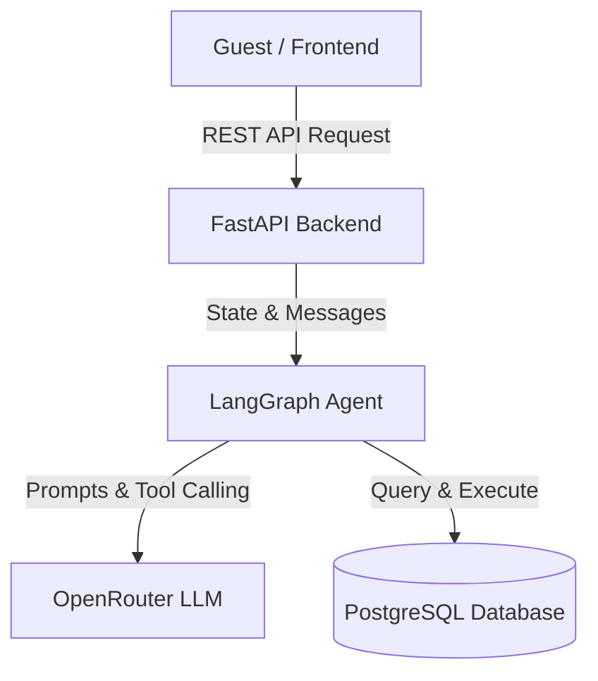

# StayEase AI Agent - Architecture & Documentation 🏨🤖

## 1.1 System Overview
The StayEase AI Agent is an intelligent, conversational customer service assistant built for a short-term accommodation rental platform in Bangladesh. It autonomously handles property searches, retrieves listing details, and executes bookings. The system leverages **FastAPI** for a robust backend REST API, **LangGraph** for structured state and workflow management, a **PostgreSQL** database for persistence, and **OpenRouter** (Nvidia Nemotron/Llama 3.1) for natural language understanding. If a guest's request falls outside the defined scope (Search, Details, Book), the agent gracefully escalates the conversation to a human.

### System Architecture

## 1.2 Conversation Flow

Here is a step-by-step breakdown of how the system processes a standard guest inquiry:

1. **Guest Request:** A user sends a message via the frontend: *"I need a room in Cox's Bazar for 2 nights for 2 guests."*
2. **API Reception:** The FastAPI backend receives the request at `POST /api/chat/{conversation_id}/message` and appends the message to the current chat history.
3. **Agent Evaluation:** The LangGraph workflow begins. The LLM analyzes the prompt and determines the user's intent is to search for a property.
4. **Tool Invocation:** The LLM decides to call the `search_available_properties` tool, passing "Cox's Bazar" as the location argument.
5. **Database Query:** The tool connects to PostgreSQL, querying the `listings` table for available properties matching the criteria.
6. **Response Generation:** The tool returns the data to the LLM, which formats it into natural language: *"I found 2 available properties for you in Cox's Bazar:\n- Ocean View Resort (BDT 4500/night)\n- Sea Pearl Hotel (BDT 6000/night)\nWould you like more details on either?"*
7. **Delivery:** FastAPI sends this formatted response back to the guest.
## 1.3 LangGraph State Design
The agent uses a `TypedDict` to maintain conversational context and workflow routing.

| Field Name | Type | Explanation |
| :--- | :--- | :--- |
| `messages` | `Annotated[list, add_messages]` | Maintains the chronological chat history and tool call outputs. |
| `escalate_to_human` | `bool` | A flag indicating if the conversation contains out-of-scope requests requiring human intervention. |

---

## 1.4 Node Design

* **`escalation_check_node`**
  * **What it does:** Scans the latest user message for trigger keywords (e.g., refund, broken, human) to determine if human support is needed.
  * **What it updates:** `escalate_to_human` (True/False).
  * **Next Node:** Goes to `agent` (if False) or `END` (if True).

* **`agent_node`**
  * **What it does:** Invokes the LLM to generate a conversational response or decides which tool to call based on the user's input.
  * **What it updates:** Appends the LLM's response or Tool Call request to `messages`.
  * **Next Node:** Goes to `tools` (if a tool was called) or `END` (if a direct response was generated).

* **`tool_node`**
  * **What it does:** Executes the specific database functions requested by the LLM.
  * **What it updates:** Appends the execution results (`ToolMessage`) to `messages`.
  * **Next Node:** Goes back to `agent` to formulate the final answer based on the tool's output.

---

## 1.5 Tool Definitions

### 1. `search_available_properties`
* **Input:** `location` (str).
* **Output:** A formatted string listing available property titles and prices in BDT.
* **When Used:** Whenever the guest asks to find accommodations in a specific city/area.

### 2. `get_listing_details`
* **Input:** `property_name` (str).
* **Output:** A formatted string containing the location, exact price, and availability status.
* **When Used:** When a guest asks specific questions about a known property (e.g., "Tell me more about Ocean View Resort").

### 3. `create_booking`
* **Input:** `property_name` (str), `guest_name` (str), `check_in_date` (str), `check_out_date` (str).
* **Output:** A confirmation string containing a unique Booking ID.
* **When Used:** When a guest explicitly confirms they want to book a specific property for specific dates.

---

## 1.6 Database Schema Design

**1. `listings` (Table)**
* `id` (SERIAL / Primary Key)
* `title` (VARCHAR)
* `location` (VARCHAR)
* `price_per_night_bdt` (NUMERIC)
* `is_available` (BOOLEAN)

**2. `bookings` (Table)**
* `id` (SERIAL / Primary Key)
* `listing_id` (INTEGER / Foreign Key -> listings.id)
* `guest_name` (VARCHAR)
* `check_in_date` (DATE)
* `check_out_date` (DATE)

**3. `conversations` (Table)**
*(Note: Currently implemented in-memory for the skeleton, but designed as follows for production)*
* `conversation_id` (VARCHAR / Primary Key)
* `history` (JSONB)
* `is_escalated` (BOOLEAN)

## 📸 Project Screenshots

